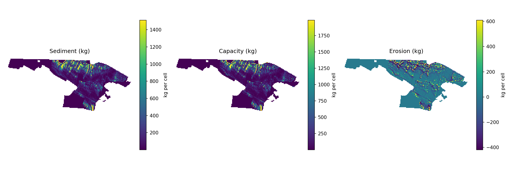

# WaTEM-SEDEM (Python BMI Wrapper)

The repo lets you run the core WaTEM-SEDEM model using Python, wrapped with the Basic Model Interface (BMI) with the use of simplified input file preprocessing logic from [pywatemsedem](https://github.com/watem-sedem/pywatemsedem).

It can be used in two ways:

- **As a standalone script** via `src/run_watem.py` — to run directly using a config file.  
- **As a BMI module** (`bmi_watem.py`) — within a wrapper to integrate into larger model frameworks.

**Note:** This is not a full-featured version. It supports a single default scenario with no tillage, strips, infrastructure, or multi-factor options. Modes control *input files configuration* only.

---

## Structure

- `src/` — Python scripts for preprocessing, execution, and BMI access  
- `data/` — example input files under `rasters/` and `pywatemsedem_input/`. The object is a test area within All-Russian Research Institute of Reclaimed Lands   
- `tests/` — reference outputs per input mode  
- `metadata/` — JSON descriptors like `WaTEM_SEDEM_STD_extended.json` (schema + standard model metadata)  
- `config.yaml` — central run configuration
- `userchoices.ini` — default preprocessing settings file for building the Scenario object (from pywatemsedem). See [pywatemsedem docs](https://watem-sedem.github.io/pywatemsedem/getting-started/api.html)
---

## Run Modes

Depending what input data you have, a few modes are available:

| Mode          | WaTEM covariates (K, C, P, ktc, etc.)     | DTM covariates (slope, aspect, LS, flow dir, etc.)             |
|---------------|------------------------------------------|----------------------------------------------------------------|
| **external**  | Must exist as files; error if any missing | Must exist as files; error if any missing                      |
| **hybrid**    | Use external files if present; compute if possible; fall back to scalars (default values) if not | Use external files if present; compute if missing              |
| **user_dtm**  | Compute/fallback to scalars if missing    | Must exist as files; error if any missing                      |
| **user_watem**| Must exist as files; error if any missing | Compute if missing                                             |
| **internal**  | Compute all from available base data      | Compute all from available base data                           |

**Possible input configuration examples:**  
- Only DTM, catchment mask, and landuse — use `hybrid`.
- DTM, catchment mask, landuse, Kfactor and river vector/raster — use `internal`.  
- DTM and Precomputed slope/aspect/LS but no WaTEM rasters — use `user_dtm`.  
- DTM and Precomputed WaTEM rasters but no slope/aspect/LS — use `user_watem`.  
- Complete set of DTM-related and WaTEM rasters — use `external`.  

None of these change the core model logic—just how data is supplied.

---

## How to Run

Some preprocessing steps (e.g., slope, LS-factor) call **SAGA GIS** (`saga_cmd`).  
Ensure SAGA is installed and available in your `PATH`. Usability has been checked for **SAGA GIS 8.5.1**  
([download here](https://sourceforge.net/projects/saga-gis/files/SAGA%20-%208/SAGA%20-%208.5.1/)).

### 1. Clone and install
```bash
git clone https://github.com/pihchikk/Watem-SEDEM-python.git
cd Watem-SEDEM-python
pip install -r requirements.txt
```
### 2. Prepare data

Place input data:

- `data/rasters/` — DEM and any **precomputed DTM covariates** (slope, aspect, LS, flow direction…) and any **WaTEM rasters** (K, C, P, ktc…).
- `data/pywatemsedem_input/` — **pywatemsedem base inputs** (e.g., landuse, catchment, DEM for pywatemsedem processing).

> **Note:** The DEM should be present in **both** `data/rasters/` and `data/pywatemsedem_input/` if you want internal computations to work.

### Filling `config.yaml`:

- **General settings** — model version, `mode` (see *Run Modes* above), and scenario metadata.  
- **Input paths** — the location of precomputed input rasters (`data/rasters/`) and pywatemsedem inputs (`data/pywatemsedem_input/`).  
- **Layer sources** — for each model variable specify:
  - `source: external` — must exist as a file, otherwise error  
  - `source: compute` — always computed from DEM  
  - `source: auto` — use external file if found, else compute from DEM  
- **Defaults** — scalar values used if a required raster is missing and `mode` allows to use scalars. > **Note:** Rfactor and bulk-density can be passed as a scalar value in any mode 
- **DTM covariates** — enable/disable computing slope, aspect, LS-factor, etc (can be omitted if you have all the necessary files).  
- **Output settings** — folder, format, units, and whether to save rasters or png plots.

> **Example:**  
> If you only have a DEM, catchment mask, and landuse, you can set  
> `mode: hybrid` to let the model compute missing DTM covariates and use default scalars for WaTEM factors.

### 3. From the repo root:
```bash
python src/run_watem.py -c config.yaml --mode hybrid
```
Other flags include:

- `-c, --config PATH` — path to the YAML config (e.g., `config.yaml`).
- `--mode {external|hybrid|user_dtm|user_watem|internal}` — how inputs are sourced.
- `--save-rasters` — write GeoTIFF outputs.
- `--save-plots` — save png PNG maps.

Values from CLI override those in `config.yaml`.

## BMI quick start

```python
from src.bmi_watem import BmiWaTEM

m = BmiWaTEM()
m.initialize("config.yaml")
m.update()  # single annual step
sed = m.get_value("SEDI_OUT")
m.finalize()
print(type(sed), getattr(sed, "shape", None))
```
---

## Example maps generated by the model:


