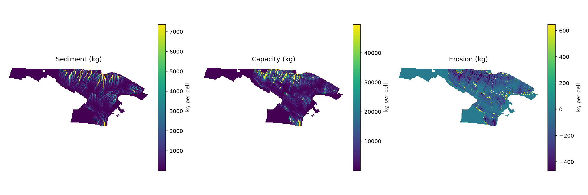

# WaTEM-SEDEM (Python BMI Wrapper)

The repo lets you run the core WaTEM-SEDEM model in Python, wrapped with the Basic Model Interface (BMI) with the use of simplified input preprocessing logic from [pywatemsedem](https://github.com/watem-sedem/pywatemsedem).

It can be used in two ways:

- **As a standalone script** via `src/run_watem.py` - to run directly using a config file.  
- **As a BMI module** (`bmi_watem.py`) - within a wrapper to integrate into larger model frameworks.

**Note:** This is not a full-featured version. It supports a single default scenario with no tillage, strips, infrastructure, or multi-factor options. Modes control *input files configuration* only.

---

## Structure

- `src/` - Python scripts for preprocessing, execution, and BMI access  
- `data/` - example input files under `rasters/` and `pywatemsedem_input/`. The object is a test area within All-Russian Research Institute of Reclaimed Lands   
- `tests/` - reference outputs per input mode  
- `metadata/` - JSON descriptors like `WaTEM_SEDEM_STD_extended.json` (schema + standard model metadata)  
- `config.yaml` - central run configuration
- `userchoices.ini` - default preprocessing settings file for building the Scenario object (from pywatemsedem). See [pywatemsedem docs](https://watem-sedem.github.io/pywatemsedem/getting-started/api.html)
---

## Run Modes

Depending what input data you have a few modes are available:

| Mode          | WaTEM covariates (K, C, P, ktc, etc.)     | DTM covariates (slope, aspect, LS, flow dir, etc.)             |
|---------------|------------------------------------------|----------------------------------------------------------------|
| **external**  | Must exist as files; error if any missing | Must exist as files; error if any missing                      |
| **hybrid**    | Use external files if present; compute if possible; fall back to scalars (default values) if not | Use external files if present; compute if missing              |
| **user_dtm**  | Compute/fallback to scalars if missing    | Must exist as files; error if any missing                      |
| **user_watem**| Must exist as files; error if any missing | Compute if missing                                             |
| **internal**  | Compute all from available base data      | Compute all from available base data                           |

**Possible input configuration examples:**  
- Only DTM, catchment mask, and landuse - use `hybrid`.
- DTM, catchment mask, landuse, Kfactor and river vector/raster - use `internal`.  
- DTM and Precomputed slope/aspect/LS but no WaTEM rasters - use `user_dtm`.  
- DTM and Precomputed WaTEM rasters but no slope/aspect/LS - use `user_watem`.  
- Complete set of DTM-related and WaTEM rasters - use `external`.  

None of these change the core model logic, just the input configuration.

---

## How to Run

### SAGA engine
Some preprocessing steps (e.g., slope, LS-factor) call **SAGA GIS** (`saga_cmd`).  
Ensure SAGA is installed and available in your `PATH`. Usability has been checked for **SAGA GIS 8.5.1**  
([download here](https://sourceforge.net/projects/saga-gis/files/SAGA%20-%208/SAGA%20-%208.5.1/)).

### GDAL engine
This project uses Fiona/Rasterio/GeoPandas, which require the **GDAL C library** at runtime.

**Ubuntu/Debian**
```bash
sudo apt-get update && sudo apt-get install -y libgdal34 gdal-bin
# use libgdal35/libgdal36 if your wheel targets a different GDAL ABI
```

**Windows** (recommended: conda-forge)
```powershell
conda create -n WaTEM-SEDEM-python -c conda-forge python=3.12 gdal fiona rasterio geopandas pyproj shapely
conda activate WaTEM-SEDEM-python
pip install -r requirements.txt --no-deps
```


### 1. Clone and install
```bash
git clone https://github.com/pihchikk/Watem-SEDEM-python.git
cd Watem-SEDEM-python
pip install -r requirements.txt
```
### 2. Prepare data

Place input data:

- `data/rasters/` — DTM and any **precomputed DTM covariates** (slope, aspect, LS, flow direction…) and any **WaTEM rasters** (K, C, P, ktc…).
- `data/pywatemsedem_input/` — **pywatemsedem base inputs** (e.g., landuse, catchment, DTM for pywatemsedem processing).

> **Note:** The DEM should be present in **both** `data/rasters/` and `data/pywatemsedem_input/` if you want internal computations to work.

### Filling `config.yaml`:

- **General settings** - model version, `mode` (see *Run Modes* above), and scenario metadata.  
- **Input paths** - the location of precomputed input rasters (`data/rasters/`) and pywatemsedem inputs (`data/pywatemsedem_input/`).  
- **Layer sources** - for each model variable specify:
  - `source: external` - must exist as a file, otherwise error  
  - `source: compute` - always computed from DEM  
  - `source: auto` - use external file if found, else compute from DEM  
- **Defaults** - scalar values used if a required raster is missing and `mode` allows to use scalars.
> **Note:** Rfactor and bulk-density can be passed as scalar values in any mode 
- **DTM covariates** - enable/disable computing slope, aspect, LS-factor, etc (can be omitted if you have all the necessary files).  
- **Output settings** - folder, format, units, and whether to save rasters or png plots.

> **Example:**  
> If you only have a DEM, catchment mask, and landuse, you can set  
> `mode: hybrid` to let the model compute missing DTM covariates and use default scalars for WaTEM factors.

### 3. Running rom the repo root:
```bash
python src/run_watem.py -c config.yaml --mode hybrid
```
Other flags include:

- `-c, --config PATH` - path to the YAML config (e.g., `config.yaml`).
- `--mode {external|hybrid|user_dtm|user_watem|internal}` - how inputs are sourced.
- `--save-rasters` - write GeoTIFF outputs.
- `--save-plots` - save png PNG maps.

Values from CLI override those in `config.yaml`.

## BMI quick start

```python
from src.bmi_watem import BmiWaTEM

m = BmiWaTEM()
m.initialize("config.yaml")
m.update()  # one epoch; safe to call repeatedly (see Coupling section below)
sed = m.get_value("SEDI_OUT")
m.finalize()
print(type(sed), getattr(sed, "shape", None))
```
---

## Coupling

WaTEM-SEDEM is a single-shot RUSLE + transport-capacity solver, not a transient
model — it has no internal time integration, so it cannot be driven inside the
same daily BMI loop as a physically-based, sub-daily model like LISEM or a
crop-growth model like AquaCrop. Instead, `BmiWaTEM` is meant to be driven as an
**epoch component**: `initialize()` performs one-time static setup (loading
rasters, deriving/ingesting flow topology), and `update()` — now safe to call
repeatedly — runs the RUSLE solve using whatever `Cfactor`/`Pfactor`/`ktc`/
`Rfactor` values were most recently set via `set_value()`.

Two coupling modes are available via `coupling_mode` in `config.yaml`:

- **`epoch`** (primary target) — one `update()` per AquaCrop growing season.
  Seasonal `Cfactor`/`Rfactor` are derived from daily AquaCrop/LISEM output
  using `src/coupling_drivers.py` (`canopy_series_to_cfactor()`,
  `rainfall_series_to_rfactor()`).
- **`event`** (lower priority) — one `update()` per rainfall event, using
  `event_rfactor()` and canopy cover at event time. Guard against
  double-counting the same storm LISEM already accounted for via
  `disable_if_lisem_covers_event` (default `true`).
- **`static`** — unchanged stand-alone behavior (default scalar/raster drivers
  from `config.yaml`), used as the baseline arm in comparisons.

When both WaTEM-SEDEM and LISEM cover the same catchment, set
`flow_direction_source: external` (with `external_flow_direction_path`) so both
models route sediment over the same D8 topology instead of WaTEM-SEDEM deriving
an independent, possibly inconsistent, flow grid.

See `docs/COUPLING_VARS_LEDGER.md` for the full variable ledger, the LISEM/
WaTEM-SEDEM division of labor, and documented sources of coupling uncertainty
(in particular the R-factor's daily-rainfall-depth approximation). A
baseline-vs-coupled comparison harness — `tests/compare_baseline_vs_coupled.py`
— quantifies what the coupling actually changes (scalar summary table, spatial
diff rasters, Spearman rank correlation, per-driver sensitivity breakdown); run
it with:

```bash
python tests/compare_baseline_vs_coupled.py -c config.yaml
```

Artifacts land in `tests/tests_epoch_coupling/` (rasters + `maps.png` +
`summary.json`), following the existing `tests_*` directory convention.

---

## Example maps generated by the model:


